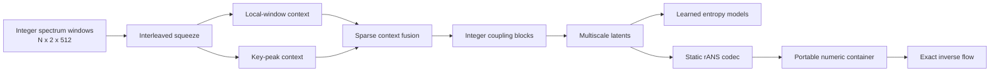

# SparseMSFlow: Hybrid Lossless Compression for Proteomics Mass Spectrometry Data

**Core implementation of SparseMSFlow for sparse peak-aware, exactly reversible
compression of fixed-width proteomics mass spectrometry windows.**

SparseMSFlow integrates sparse local/key-peak conditioning, multiscale integer
flows, learned latent entropy models, and static rANS coding in one compact,
installable Python project.

## Architecture



## Core Capabilities

| Component | Implementation |
| --- | --- |
| Sparse conditioning | Indexed local windows and high-intensity key peaks with fixed context fusion |
| Reversible transform | Additive integer coupling, interleaved squeeze, and multiscale factor-out |
| Entropy modeling | Trainable discretized logistic models for every latent level |
| Lossless coding | Deterministic static rANS with embedded CDF, shape, and symbol metadata |
| Data contract | Strict `N x 2 x 512` / `N x 512 x 2` NumPy validation |
| Workflows | CPU-compatible training, evaluation, encoding, decoding, and smoke verification |

## Repository Layout

```text
SparseMSFlow/
├── src/sparse_ms_flow/   # core model, entropy, codec, data, and workflows
├── scripts/              # train, evaluate, encode, and decode commands
├── configs/default.yaml  # complete default model and training configuration
├── examples/smoke_test.py
├── tests/                # focused unit and end-to-end smoke coverage
└── docs/                 # data contract and reproducibility guidance
```

## Installation

SparseMSFlow requires Python 3.10 or later.

```bash
python -m venv .venv
source .venv/bin/activate
python -m pip install -e ".[dev]"
```

## Quick Verification

```bash
python examples/smoke_test.py
python -m pytest -q
```

The smoke command performs a forward pass, backpropagation, latent encoding,
inverse decoding, and an exact integer round trip. A successful run prints:

```text
exact_round_trip=True
```

## Python API

```python
import torch

from sparse_ms_flow import SparseMSFlowConfig, SparseMSFlowModel

config = SparseMSFlowConfig(
    sequence_length=64,
    levels=2,
    model_dim=16,
    num_heads=4,
    feedforward_dim=32,
)
model = SparseMSFlowModel(config)
inputs = torch.randint(0, 4096, (1, 2, 64)).float()

bits_per_value = model.bits_per_value(inputs)
latents = model.encode(inputs)
restored = model.decode(latents)

assert torch.equal(restored, inputs)
```

## Data Contract

Input `.npy` files contain integer spectrum windows in either channel-first
`samples x 2 x 512` or channel-last `samples x 512 x 2` layout. The loader
normalizes both layouts to contiguous channel-first `int64` arrays. Channel 0
stores aligned mass/position values; channel 1 stores aligned intensity values.

See [docs/data-format.md](docs/data-format.md) for quantization expectations,
validation rules, and deterministic 80/10/10 splitting.

## Command-Line Workflows

| Workflow | Command |
| --- | --- |
| Train | `python scripts/train.py --data windows.npy --output model.pt` |
| Synthetic train | `python scripts/train.py --synthetic --max-steps 1 --output model.pt` |
| Evaluate | `python scripts/evaluate.py --checkpoint model.pt --data windows.npy` |
| Encode | `python scripts/encode.py --checkpoint model.pt --input windows.npy --output windows.smsf` |
| Decode | `python scripts/decode.py --checkpoint model.pt --input windows.smsf --output restored.npy` |

Every command supports `--help`, explicit paths, CPU execution, and concise
nonzero exits for missing or invalid inputs. Checkpoints retain both model
configuration and weights; compressed containers retain numeric rANS metadata
without object deserialization.

## Default Configuration

| Setting | Default |
| --- | ---: |
| Input shape | `2 x 512` |
| Flow levels | `3` |
| Squeeze factor | `4` |
| Couplings per level | `1` |
| Model dimension | `128` |
| Attention heads | `4` |
| Transformer layers | `1` |
| Local window | `32` |
| Key-peak ratio | `0.16` |
| Context fusion | `0.7` local / `0.3` key-peak |

All architecture and training values are defined in `configs/default.yaml` and
loaded through strict dataclass-backed validation.

## Engineering Guarantees

- exact flow inversion is covered across all multiscale latent levels;
- entropy parameters receive gradients through `bits_per_value`;
- rANS restores negative, sparse-alphabet, constant, and multidimensional data;
- data splits are deterministic for a fixed input order and seed;
- encoded containers use numeric NumPy fields with pickle disabled;
- source and wheel builds are validated by the test suite and smoke workflow.

Additional environment and experiment guidance is available in
[docs/reproducibility.md](docs/reproducibility.md).

Security reports are handled through GitHub Private vulnerability reporting as
described in [SECURITY.md](SECURITY.md).

## License

SparseMSFlow is provided under the terms in [LICENSE](LICENSE).

## Citation

Citation metadata will be added with the public paper release.
